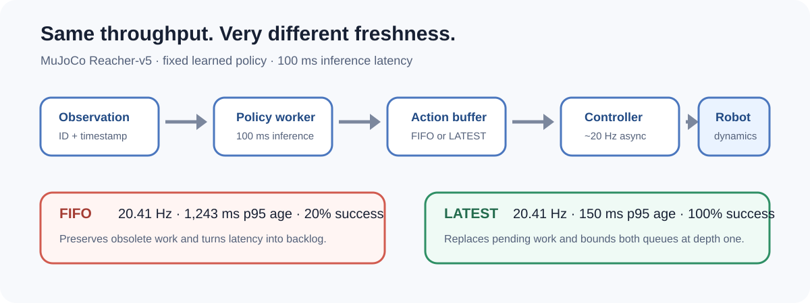
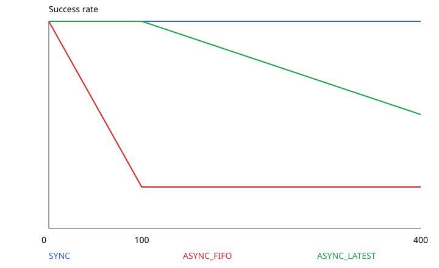

# Latency-Aware Runtime for Closed-Loop Robot Policies

An instrumented asynchronous policy runtime that makes **action freshness**—not
just throughput—a first-class control metric.

## The problem

Neural robot policies can infer more slowly than the controller produces new
observations. A FIFO queue preserves every request and may keep the controller
busy, but the resulting actions can describe a world state that is already more
than a second old.

This project compares three execution semantics:

- **SYNC:** infer from the current observation, then act; fresh but blocking.
- **FIFO:** preserve all pending work; high apparent throughput but unbounded
  backlog.
- **LATEST:** replace pending observations/actions with the newest available
  item; bounded backlog without cancelling in-flight inference.

## Headline result

On MuJoCo `Reacher-v5` with a fixed learned SAC policy and 100 ms injected
inference latency:

| Scheduler  |  Success | Control rate | p95 action age |
| ---------- | -------: | -----------: | -------------: |
| SYNC       |     100% |      9.90 Hz |         102 ms |
| FIFO       |      20% |     20.41 Hz |       1,243 ms |
| **LATEST** | **100%** | **20.41 Hz** |     **150 ms** |

LATEST reduced p95 action age by about **88%** versus FIFO while preserving the
same nominal 20 Hz control rate. At 400 ms, LATEST still bounded both queues but
success fell to 55%: queue policy removes avoidable backlog, not intrinsic model
latency.

## What I built

- Separate observation producer, policy worker, action buffer, and controller
  processes with explicit FIFO/LATEST replacement semantics.
- End-to-end provenance for every executed action: source observation ID and
  timestamp, inference interval, action ID, and execution timestamp.
- A checked decomposition of action age into observation wait, policy latency,
  and post-inference action wait.
- Two evaluation settings: a controlled learned Chunk-BC benchmark and an
  independent MuJoCo environment with a fixed learned SAC policy.
- Deterministic aggregation, queue-depth monitoring, and tests for runtime
  messages, buffers, policy/control workers, and formal benchmark contracts.

## Why throughput is not enough

At 100 ms latency, FIFO and LATEST both reported about 20.4 controller ticks per
second. FIFO nevertheless accumulated 1.11 s p95 observation wait and completed
only 20% of episodes. LATEST kept observation and action queues at depth one and
completed all episodes.

The controller rate alone therefore looked healthy while closed-loop decisions
were obsolete. Action age exposed the actual systems failure.

## Controlled action-chunk evidence

The first benchmark used a learned Chunk-BC reaching policy with horizon 16 and
four executed actions per plan. It intentionally stresses plan ownership:
preserving obsolete chunks in FIFO can create a backlog even when artificial
inference latency is zero. LATEST kept both queues bounded and retained 100%
success at 0 and 100 ms, while FIFO failed across the formal matrix.

The second benchmark moved the same scheduling mechanism to unmodified MuJoCo
`Reacher-v5` and a single-action SAC policy. This separated the general freshness
effect from the chunk-specific stress test.

## Scope and limitations

- This is state-based simulation; there is no physical robot or vision stack.
- Latency is injected with wall-clock delay rather than measured from a VLA.
- SYNC remains successful at high latency because wall-clock sleep reduces the
  control rate without changing MuJoCo's state-transition count.
- LATEST is not a universal dropping policy. Safety-critical commands need
  separate ownership, validity windows, and deterministic fallback control.

## Repository guide

- [RESULTS.md](RESULTS.md) — full matrices and formal artifacts
- [INTERVIEW_GUIDE.md](INTERVIEW_GUIDE.md) — concise explanation and technical Q&A
- [Architecture](docs/ARCHITECTURE.md) — process and timestamp design
- `runtime/` — messages, buffers, workers, runner, and benchmark logic
- `tests/` — runtime and experiment-contract tests

**Core takeaway:** a robot runtime can maintain high throughput while executing
stale decisions. Closed-loop systems must measure and control freshness directly.
