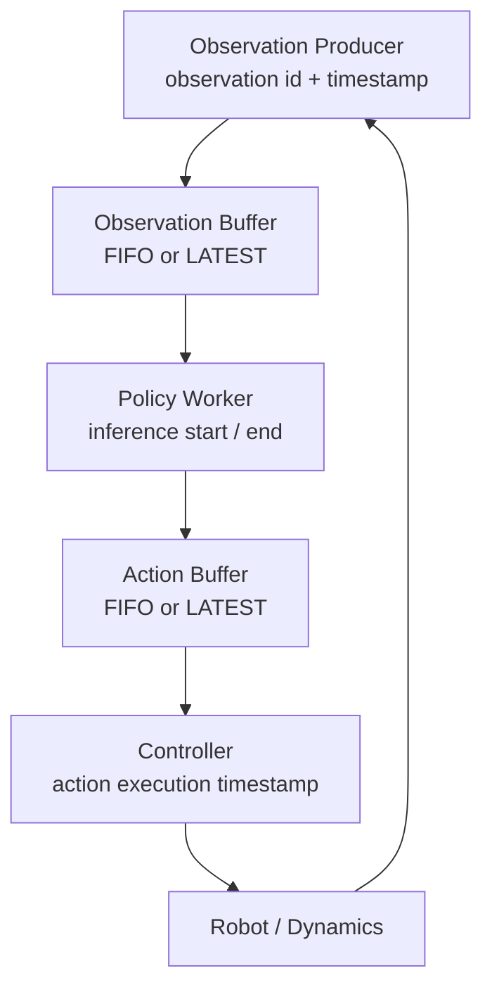

# Architecture and scheduling semantics

## Modes

| Mode | Observation handling | Action handling | Trade-off |
| --- | --- | --- | --- |
| SYNC | infer immediately | execute immediately | Fresh, but worker blocks controller |
| ASYNC_FIFO | retain all in order | retain all in order | Throughput can remain high while staleness grows |
| ASYNC_LATEST | replace unstarted pending observation | replace pending action | Bounded pending queues; intentionally drops stale work |

For an executed action, `action_age = execution_timestamp - source_observation_timestamp`. It decomposes into `observation_wait + policy_latency + action_wait` (M5C) or `observation_wait + policy_latency + plan_age` (M4). All timestamps share a `perf_counter()` clock domain.

LATEST does not cancel inference already in progress or an action already executing. Its guarantee is bounded *pending* queues, not zero latency.
